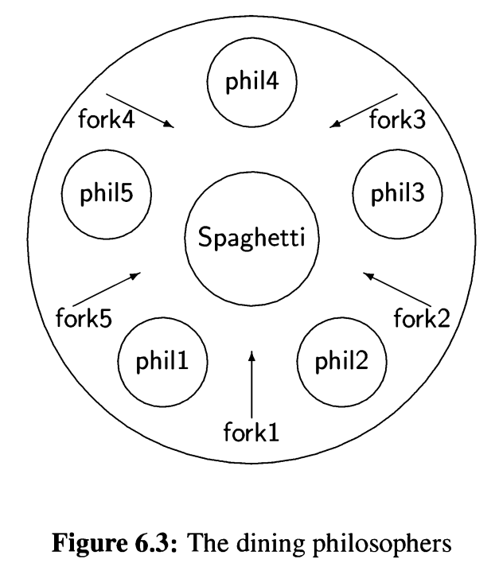

# Problema de los filosofos

Cinco filósofos se sientan alrededor de una mesa y pasan
su vida cenando y pensando.

Cada filósofo tiene un plato de fideos y un palito chino a la
izquierda de su plato. Para comer los fideos son
necesarios dos palitos y cada filósofo sólo puede tomar
los que están a su izquierda y derecha. Si cualquier
filósofo toma un palito y el otro está ocupado, se quedará
esperando, con el palito en la mano, hasta que pueda
tomar el otro palito, para luego empezar a comer.

[Notion](https://mis-notas.notion.site/Tarea-cbb9e56364964b03894375e12da73bae?pvs=4)
